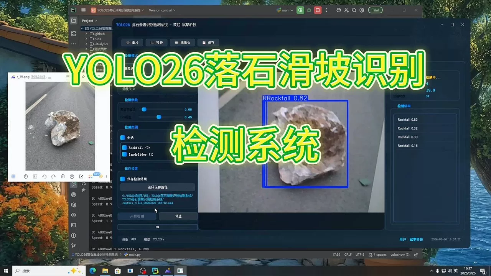
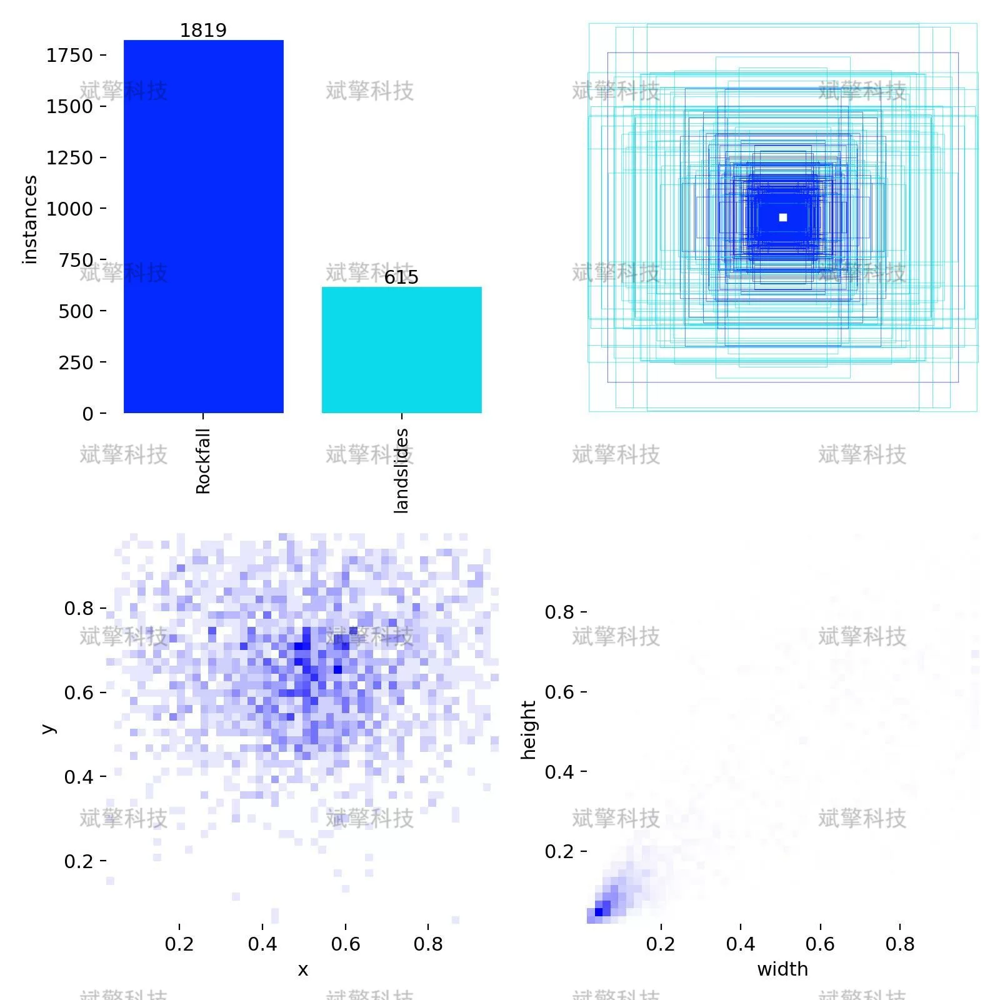
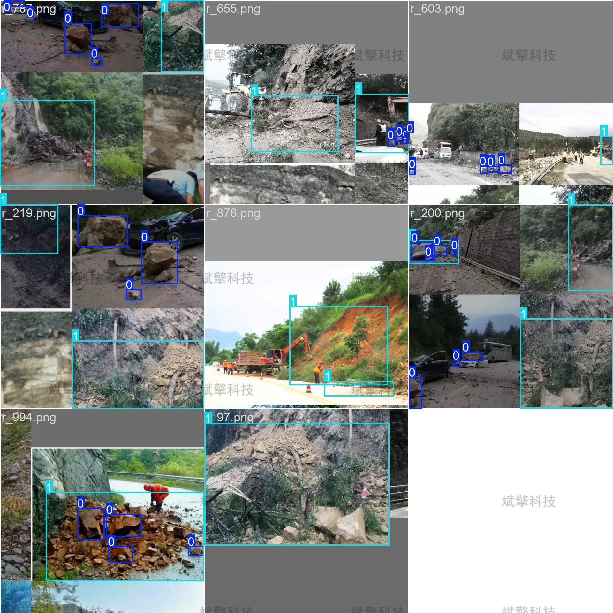
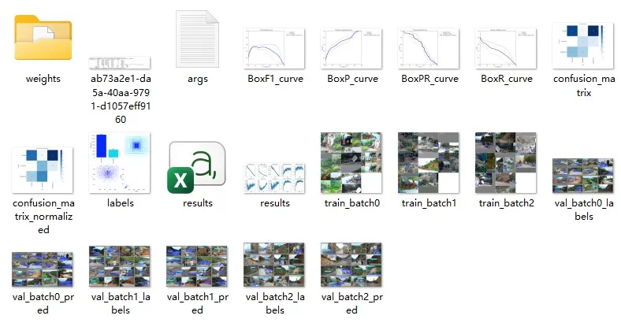
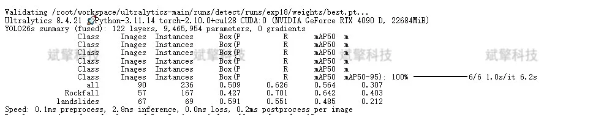
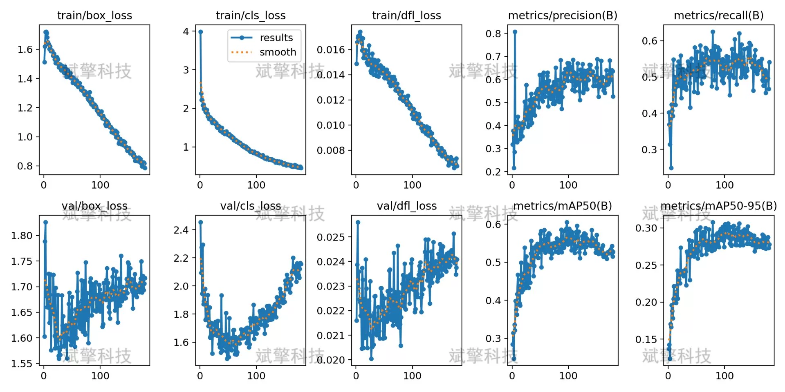
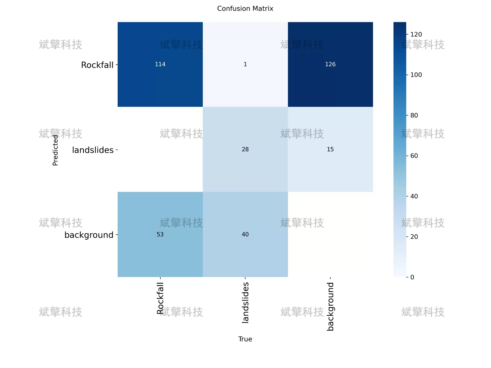
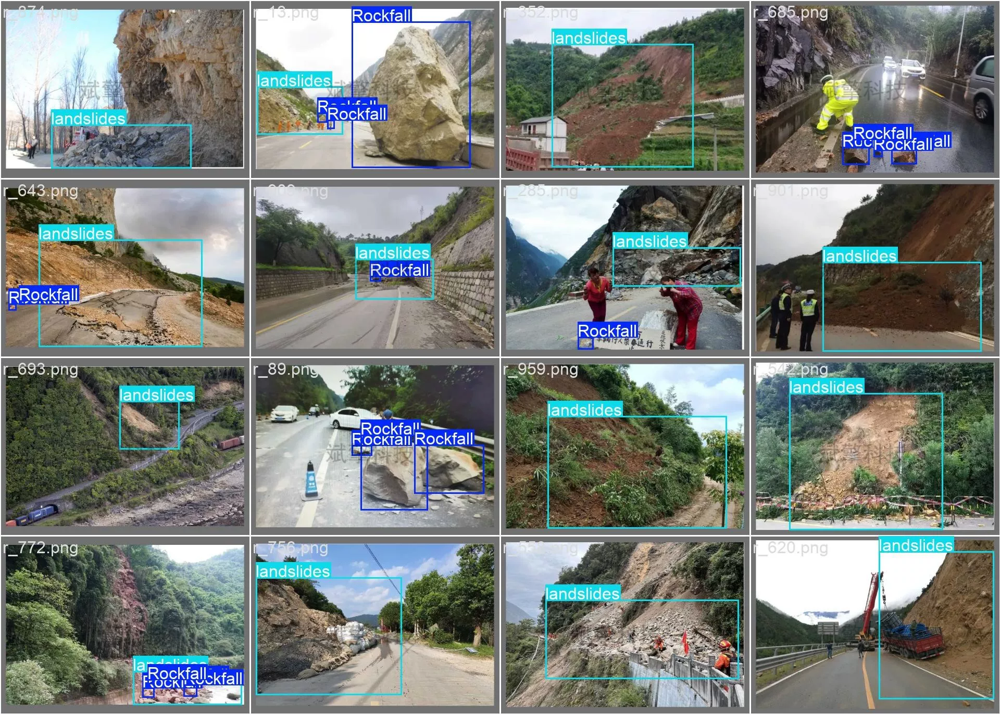
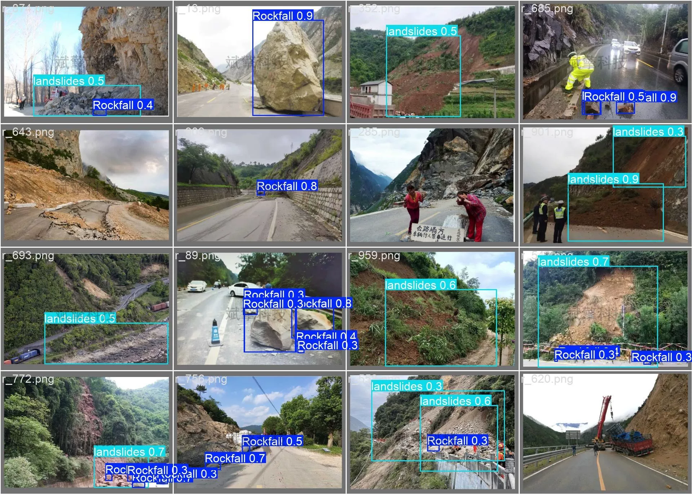

# YOLOv26 Landslide Detection System | Source Code + Model

## Body

YOLO26 Landslide and Fall Detection System: From Data Collection to Geological Disaster Automatic Location, A Full Process from Dataset Construction to Automated Geo-Hazard Identification

Landslides and falls are common geological disasters in mountainous areas of China, characterized by their suddenness, high destructiveness, and difficulties in monitoring and early warning. They pose a serious threat to the safety of mountain roads, railways, and residential areas. Addressing the issues of low efficiency in manual inspections and high costs of sensor monitoring, this paper proposes an improved YOLO26 object detection method for the automatic identification and localization of landslides and falls. The study has constructed a dataset containing 1000 labeled images (810 training, 90 validation, 100 test), covering samples of landslides and falls under different terrain, lighting conditions, and seasons.
Experimental results show that the model achieves an average precision mean (mAP50) of 56.4% on the validation set, with a recall rate of 70.1% for the landslide category, demonstrating good detection performance. The research findings can provide technical support for intelligent monitoring and early warning of geological disasters.

After filtering and preprocessing, a total of 1000 valid images were obtained, divided into training sets, validation sets, and test sets at a ratio of 8:1:1. The specific division is as follows:
Training set: 810 images, used for learning and optimization of model parameters
Validation set: 90 images, used for hyperparameter tuning and performance verification
Test set: 100 images, used for final model generalization ability assessment

Image labeling was conducted using LabelImg tools, adhering to the following labeling specifications:
Landslide (Rockfall): Mark isolated distributions of rock blocks with distinct boundaries from surrounding terrain, with labeled boxes encompassing complete rock contours, leaving appropriate edge margins
Fall (landslides): Mark the overall range of the landslide body, including the source area, bedrock, and accumulation zone, for large landslides using multiple labeled boxes covering different parts of the slide

Free reservation for remote installation. Unsuccessful refund guaranteed.
Purchase includes the following resources (accessed automatically via Baidu Cloud):
YOLO recognition detection project complete source code
YOLO format datasets
Training code + UI interface code
Trained model + result images
Software installer
Add WeChat for remote installation (automatically displayed after purchase) - Unsuccessful refund guaranteed

⚙️ Core functionality modules
Detection capabilities
- Image detection: Upload and check immediately, returning detection boxes + category information
- Video detection: Supports video files, analyzing frames accurately
- Camera real-time detection: Connects to USB cameras, achieving dynamic monitoring
Interaction and control
- Target selection: Choose one or more categories for detection
- Parameter adjustment: Adjustable confidence threshold & IoU threshold, flexibly controlling accuracy
- Results saving: One-click save of images/videos/camera detection results
System and data
- User login registration: Supports password strength checking + encryption storage
- Log recording: Automatically records operation and error information (timestamped)

## Images

## Payment

Here is a pay link on Stripe ( https://buy.stripe.com/3cs8yP7sY87d0vu9AB ). Please contact me lonlonago@foxmail.com after funding $89, and I will send you a complete data files , thank you!

